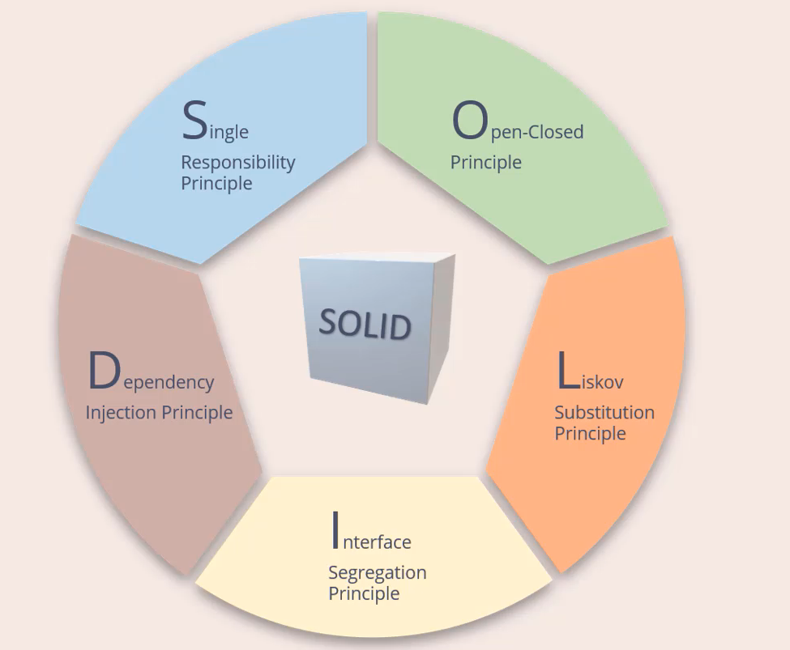

## SOLID

The SOLID principles were introduced by Robert C. Martin in his 2000 paper “Design Principles and Design Patterns.” These concepts were later built upon by Michael Feathers, who introduced us to the SOLID acronym. And in the last 20 years, these five principles have revolutionized the world of object-oriented programming, changing the way that we write software.

So, what is SOLID and how does it help us write better code? Simply put, Martin and Feathers' design principles encourage us to create more maintainable, understandable, and flexible software. Consequently, as our applications grow in size, we can reduce their complexity and save ourselves a lot of headaches further down the road!

SOLID principles complement each other, and work together in unision, to achieve the common purpose of well-designed software.

All examples in this repo was made in Java.

## The SOLID Principles

<a href="single-responsability-principle.md">Single Responsability Principle</a>  
<a href="open-closed-principle.md">Open-Closed Principle</a>  
<a href="liskov-substitution-principle.md">Liskov Substitution Principle</a>  
<a href="interface-segregation-principle.md">Interface Segregation Principle</a>   
<a href="dependency-inversion-principle.md">Dependecy Inversion Principle</a>  
### Vocabulary

**Cohesion**: is the degree to witch the various parts of a software component are related. 
**Coupling**: is defined as the level of inter dependency between various software components. 
