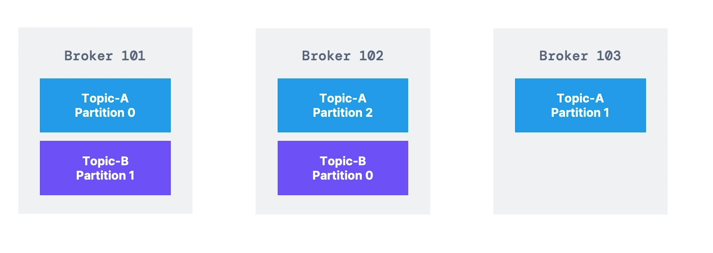
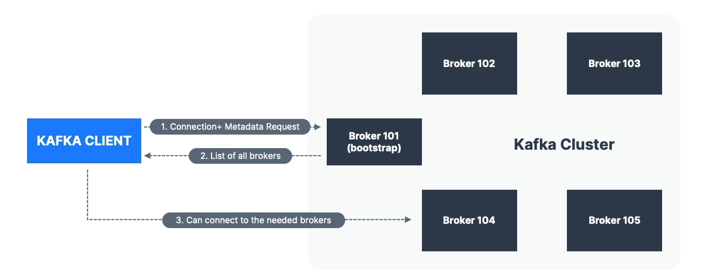
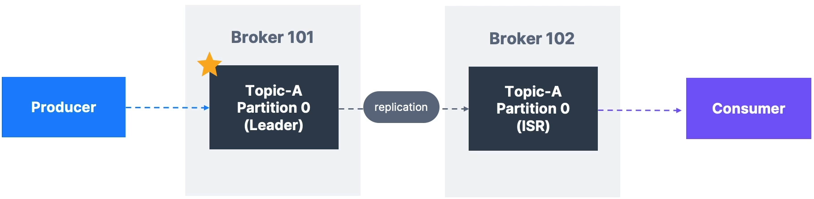

# Kafka

Created by Linkedin, open-source mainly maintained by Confluent, IBM and Cloudera.

Distributed, resilient architecture, fault tolerant.

Horizontal scalability:
  - can scale to 100s of broker;
  - can scale to millions of messages per second;

High performance.

Use cases:
- Messaging system;
- Activity tracking;
- Gather metrics from many different locations;
- Application logs gathering;
- Stream processing;
- De-coupling system dependencies;
- Micro-services pub/sub;

If you have 4 Source systems and 6 Target systems, you need to create 24 integrations,
each one with its own difficulties: 
 - Protocol
 - Data format
 - Data schema
 - Increase system load

With Kafka:

## Topics
A particular stream of data, like a table in a database, you can have as many topics as you want, a topic is identified by its name,
any kind of message format, the sequence of messages is called DATA STREAM. You cannot query topics, instead, use Producers to send data 
and Consumers to read data

## Partitions
Topics are split in partitions, ordered in each partition.

Topics are immutable, once data is written to a partition, it cannot be changed.

Data is kept only for a limited time (default is one week), offset only have a meaning for a specific partition and are not re-used even if previous 
messages have been deleted. Order is guaranteed only within a partition and not across, data is assigned randomly to a partition.

## Producers
Writes data to topics, and know to which partition to write to.
In case of broker failures, producers will automatically recover.
Producers can choose to send a key with the message (string, number, binary), if key is null, data is sent round robin,
if key is not null, then all messages for that key will always got to the same partition (typically sent if you need 
message ordering for a specif field).

## Message

## Serializer
Turn data into bytes, Kafka only accepts bytes as an input from producers and send bytes out as an output to consumers:

## Consumers
Consumes data from a topic - pull model, automatically knows which broker to read from, in case of failure, consumers know 
how to recover, data is read in order from low to high offset within each partition.

## Deserialization

Transform bytes in objects/data, used in key and value of the message;

## Consumers Group

Each consumer within a group reads from exclusive partitions.

## Consumers Offset

Kafka stores the offsets at which a consumer group has been reading.
When a consumer in a group has processed data received from kafka, it should be periodically committing the offsets,
if a consumer dies, it will be able to read back from where it left.
The 3 delivery semantics for commit are:
- At least once (usually preferred)
- At most once
- Exactly once

## Brokers

A kafka cluster is composed of multiple brokers (servers), each broker is identified with its id, each broker contains 
certain topic partitions, after connecting to any broker you will be connected to the entire cluster.

Every kafka broker is also called bootstrap server.

## Topic Replication

Topics should have a replication factor (between 2 and 3).

At any time only one broker can be a leader for a given partition.
Producers can only send data to the broker that is leader of a partition, the other brokers
will replicate the data. Therefore, each partition has one leader and multiple ISR (in-sync replica).

Producers can only write to the leader broker for a partition, consumers by default will read from the leader. 

### Consumers Replica Fetching

Its possible to configure consumers to read from the closest replica.

## Producer Acknowledgements (acks)

acks = 0: Producer won't wait for acknowledgement (possible data loss)
acks = 1: Producer will wait for leader acknowledgement (limited data loss)
acks = all: Leader + replicas acknowledgement (no data loss)

## Topic Durability

For a topic replication factor 3, topic durability can withstand 2 brokers loss.